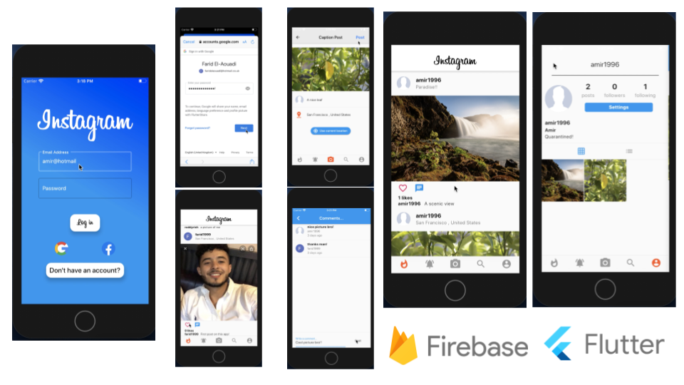

Features:
- Authentication using Google, Facebook or Email
- Users can upload pictures, follow other users, search for users, edit their profile page, keep updated with who interacts with them (likes their pictures, comments on their pictures or follows them) and scroll through a timeline of posts from users they follow.

The video shows the main functionality of the app where two users interact with each other. The cross platform app was made using Flutter for the backend is firebase. The backend consists of a noSQL database using firestore, authentication as well as firebase functions which help send push notifications to users as well as keep data across the app in sync across all devices. Storage of user media is also on firebase and has been optimised so it stores a lossy file so GCP doesnt make me broke.

Instructions to run application:

- Clone the repo locally
- Open in IDE
- Get dependencies listed in the pubspec.yaml by running pub get
- Run the build
- Test on device

(The server is set up and doesn't require any modification on your part for the app to run)

Any questions? Open an issue in Github Repo and i will promptly seek to resolve your issue.
